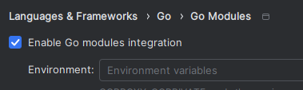

# yzc
Yz language compiler 

## Build 

```shell
go build yzc/cmd/yzc
```

## Test
```shell
go test yzc/internal
```

## Run
```shell
yzc source_dir 
```

## IntelliJ IDEA setup

Click on "Enable GO modules integration"  on "Settings" > "Languages & Frameworks" > "GO" > "GO Modules"  


## Language Documentation

[Yz Design Notes](https://github.com/oscarryz/yz-design-notes)
